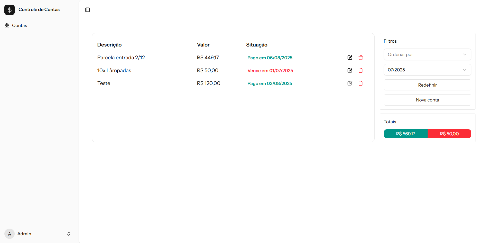

# Bills control

Web system to control my bills



## Technologies

- React.JS
- Laravel

## Developer enviroment setup

Create env file and 

```
cp .env.example .env
```

Set the port where Laravel will serve the application

```
APP_PORT=8080
```

Build image and run the container

```
docker compose up --build
```
